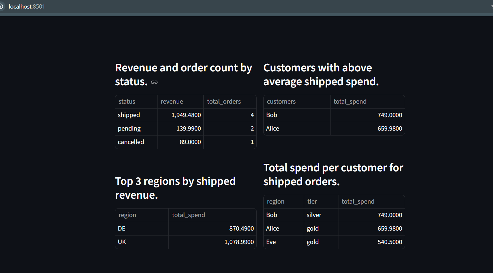

### Description
A streamlit app which show the results of 4 queries (_Revenue and order count by status_, _Customers with above average shipped spend._, _Top 3 regions by shipped revenue._ and _Total spend per customer for shipped orders._). 

- Dashboard with all queries results
    

---
### To Run
1. Install packages in `requirements.txt`.
2. Run `python db.py` to create sqlite DB and load data from CSVs.
3. To run streamlit app via: `streamlit run main.py`.
